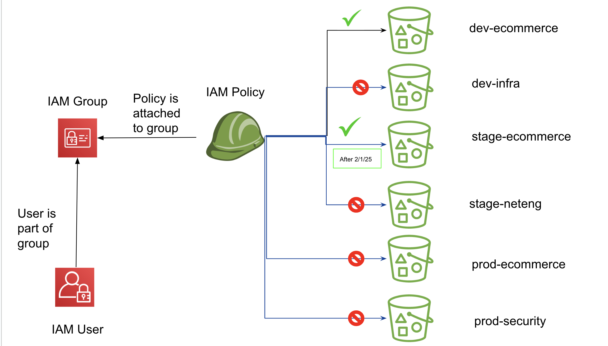

# demo

## Diagram


## Get Started

Here are instructions on installing AWS CLI: https://docs.aws.amazon.com/cli/latest/userguide/getting-started-install.html

Now install the`terraform` CLI. You can find instructions here: https://developer.hashicorp.com/terraform/tutorials/aws-get-started/install-cli

## Execute
The TF code does the following:
- Stages S3 resources that we'll use as test cases for our IAM resources.
- Creates the new user `dev-user-1`.
- Provisions the IAM group and policy to meet the following conditions:
  - Initially the developer should be able to have read/write access to ecommerce objects in dev, but after 6 months of their hire date, the developer should be granted the same rights to the stage environment.
  - Assume start date of August 1, 2024
- Adds user to the IAM group


To run this code:
```sh
cd tf/
terraform init
terraform apply -auto-approve
```

## Testing
To test:
- Generate access key credentials for the new user that was created in your account (`dev-user-1`)
- Configure your aws CLI to use those new credentials by adding the following to your ~/.aws/credentials file:
```sh
aws configure --profile dev-user-1

AWS Access Key ID [None]: YOUR_ACCESS_KEY_ID_FOR_USER1
AWS Secret Access Key [None]: YOUR_SECRET_ACCESS_KEY_FOR_USER1
Default region name [None]: us-east-2
Default output format [None]: json
```

- Run the following s3 commands:
  - `aws --profile dev-user-1 s3 ls s3://dev-ecommerce-${random_string}`
    - This should succeed
  - `aws --profile dev-user-1 s3 ls s3://dev-infra-${random_string}`
    - This should fail
  - `aws --profile dev-user-1 s3 ls s3://stage-ecommerce-${random_string}`
    - This should fail
  - `aws --profile dev-user-1 s3 ls s3://stage-neteng-${random_string}`
    - This should fail
  - `aws --profile dev-user-1 s3 ls s3://prod-ecommerce-${random_string}`
    - This should fail
  - `aws --profile dev-user-1 s3 ls s3://prod-security-${random_string}`
    - This should fail

## Cleanup
```sh
terraform destroy
```

