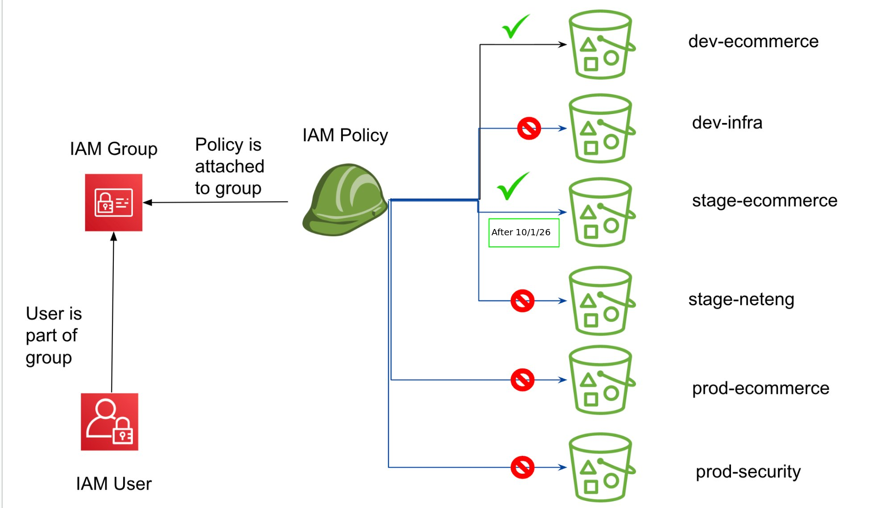

# demo

## Diagram


## Overview

This demo provisions IAM and S3 resources to demonstrate time-based, tag-scoped IAM access control.

`dev-user-1` is a new developer hired April 1, 2026. They should have:
- Read/write access to `dev` + `ecommerce` S3 bucket immediately
- Read/write access to `stage` + `ecommerce` S3 bucket only after 6 months (Oct 1, 2026)
- No access to any other environment or team bucket

## Get Started

Install the AWS CLI: https://docs.aws.amazon.com/cli/latest/userguide/getting-started-install.html

Install the `terraform` CLI: https://developer.hashicorp.com/terraform/tutorials/aws-get-started/install-cli

You will need an AWS IAM user with `AdministratorAccess` configured as a named profile. Set it as your default for the session:

```sh
export AWS_PROFILE=sara
aws sts get-caller-identity
```

## Execute

The TF code does the following:
- Stages S3 resources that we'll use as test cases for our IAM resources.
- Creates the new user `dev-user-1`.
- Provisions the IAM group and policy to meet the following conditions:
  - Initially the developer should be able to have read/write access to ecommerce objects in dev, but after 6 months of their hire date, the developer should be granted the same rights to the stage environment.
  - Assume start date of October 1, 2026
- Adds user to the IAM group

**Step 1** — Run Terraform:
```sh
cd tf/
terraform init
terraform apply -auto-approve
```

**Step 2** — Save your bucket suffix. Look at the apply output for any bucket name, e.g. `dev-ecommerce-16145140695839611247`. The number at the end is your suffix. Set it as a shell variable — run this command on its own line:
```sh
SUFFIX=<your-number-here>
```

## Testing

**Step 3** — Create access keys for `dev-user-1`:
1. Go to **IAM → Users → dev-user-1 → Security credentials → Create access key → CLI**
2. Copy the Access Key ID and Secret Access Key

**Step 4** — Configure the CLI profile. Run `aws configure --profile dev-user-1` and enter your values at each prompt:
```sh
aws configure --profile dev-user-1
```

**Step 5** — Upload a test file so buckets are not empty. Run each line separately:
```sh
echo "test" > /tmp/test.txt
```
```sh
aws --profile sara s3 cp /tmp/test.txt s3://dev-ecommerce-${SUFFIX}/test.txt
```
```sh
aws --profile sara s3 cp /tmp/test.txt s3://stage-ecommerce-${SUFFIX}/test.txt
```

**Step 6** — Run the access tests. Run each line separately:
```sh
aws --profile dev-user-1 s3 ls s3://dev-ecommerce-${SUFFIX}
```
Expected: succeeds, shows `test.txt`

```sh
aws --profile dev-user-1 s3 ls s3://dev-infra-${SUFFIX}
```
Expected: AccessDenied

```sh
aws --profile dev-user-1 s3 ls s3://stage-ecommerce-${SUFFIX}
```
Expected: AccessDenied (before Oct 1, 2026)

```sh
aws --profile dev-user-1 s3 ls s3://stage-neteng-${SUFFIX}
```
Expected: AccessDenied

```sh
aws --profile dev-user-1 s3 ls s3://prod-ecommerce-${SUFFIX}
```
Expected: AccessDenied

```sh
aws --profile dev-user-1 s3 ls s3://prod-security-${SUFFIX}
```
Expected: AccessDenied

## Simulating the 6-Month Date Condition

**Step 7** — To test stage access without waiting until Oct 1, open `variables.tf` and change the date to a past value:

```hcl
variable "stage_access_after" {
  description = "Date after which the dev can access the stage bucket"
  type        = string
  default     = "2026-01-01T00:00:00Z"
}
```

**Step 8** — Re-apply:
```sh
terraform apply -auto-approve
```

**Step 9** — Upload a test file to stage and retest. Run each line separately:
```sh
aws --profile sara s3 cp /tmp/test.txt s3://stage-ecommerce-${SUFFIX}/test.txt
```
```sh
aws --profile dev-user-1 s3 ls s3://stage-ecommerce-${SUFFIX}
```
Expected: succeeds, shows `test.txt`

```sh
aws --profile dev-user-1 s3 ls s3://stage-neteng-${SUFFIX}
```
Expected: AccessDenied (wrong team tag, never allowed)

**Step 10** — Revert `variables.tf` back to the original date and re-apply:
```hcl
default = "2026-10-01T00:00:00Z"
```
```sh
terraform apply -auto-approve
```

## Reset

To tear down and rebuild everything from scratch:
```sh
terraform destroy
```
```sh
terraform apply -auto-approve
```

Note: a new suffix will be generated — update your `SUFFIX` variable before re-running tests.

## Cleanup
```sh
terraform destroy
```